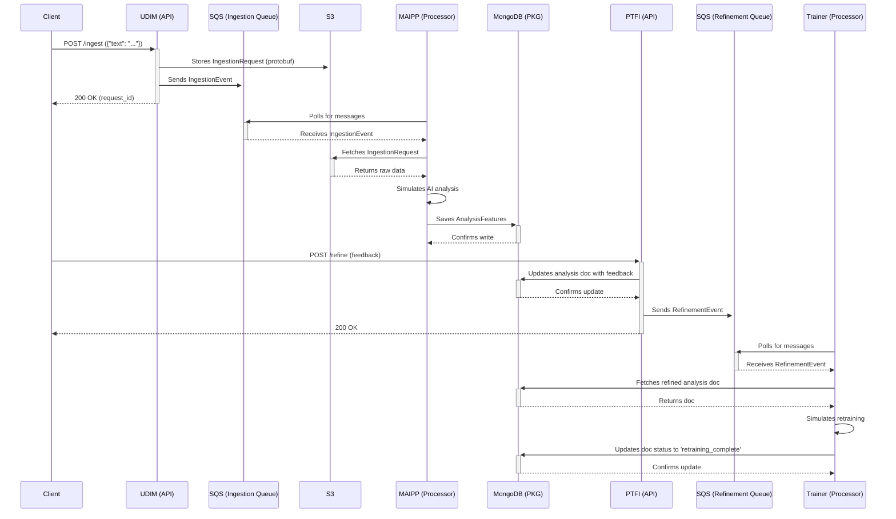

# EchoSphere System Architecture

This document provides a high-level overview of the EchoSphere system architecture, detailing the components and the flow of data between them.

## Core Principles

The system is designed as a set of decoupled microservices that communicate through a message queue (AWS SQS) and a shared data store (MongoDB). This event-driven architecture allows for scalability, resilience, and independent development of each component. Data contracts between services are standardized using Protocol Buffers.

## System Components

-   **UDIM (User Data Ingestion Module):** A FastAPI service that provides the primary API for ingesting raw text data.
-   **MAIPP (Module for AI Persona Processing):** A message-driven Python service that performs simulated AI analysis on ingested data.
-   **PTFI (Persona Training & Feedback Interface):** A FastAPI service that provides an API for users to read analysis results and provide feedback.
-   **Trainer Module:** A message-driven Python service that simulates model retraining based on user feedback.
-   **Generator Module:** A FastAPI service that generates text based on a persona's stored traits.
-   **AWS SQS:** Used as the message bus for asynchronous communication between services.
-   **AWS S3:** Used to store raw ingested data.
-   **MongoDB (Persona Knowledge Graph - PKG):** Used as the primary data store for analysis results, feedback, and persona statuses.

## Data Flow Diagram

The following diagram illustrates the end-to-end data flow for the `Ingest -> Analyze -> Refine -> Retrain` cycle.

This architecture allows each component to focus on a single responsibility, promoting a clean and maintainable codebase that aligns with the project's guiding principles.
